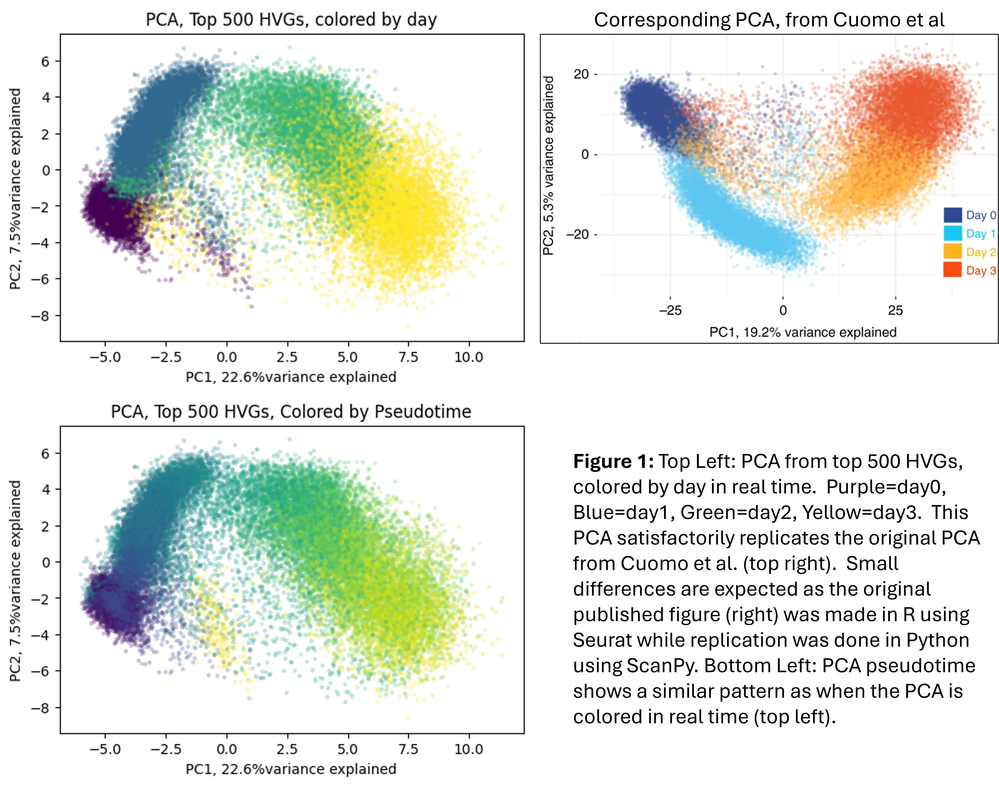
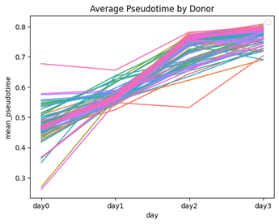
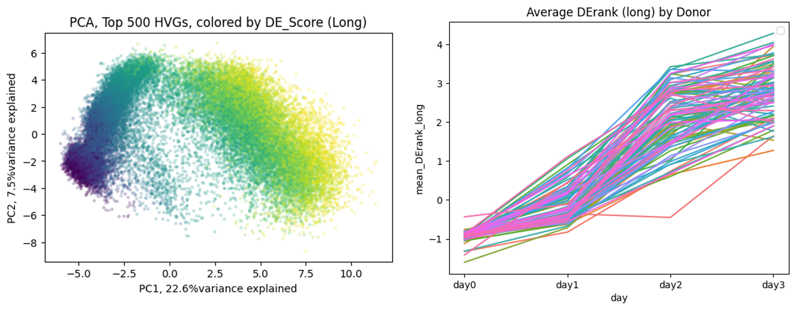
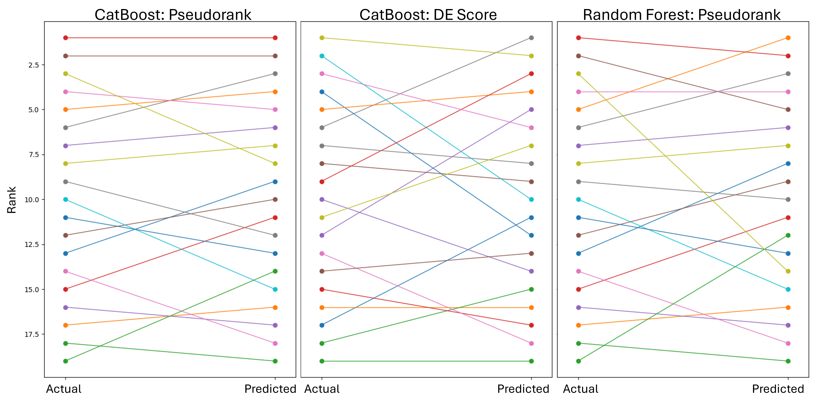
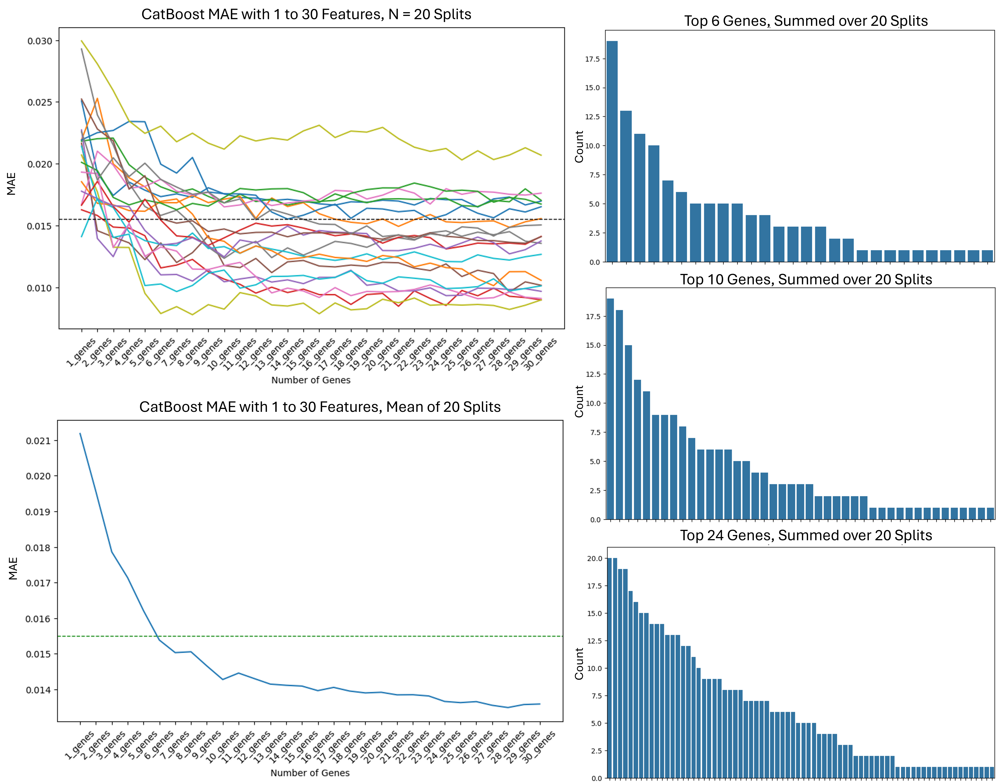

# Predicting iPSC Donor Differentiation Success

## Overview
Induced pluripotent stem cells (iPSCs) are a powerful platform for developing next-generation cell therapies. However, selecting optimal donor cell lines is expensive, time-consuming, and experimentally limited.

This project demonstrates a **machine learning pipeline** that predicts the differentiation potential of iPSC donors using RNA-seq data. Specifically, the model predicts how effectively donor-derived iPSCs differentiate into **definitive endoderm (DE)** cells.

The goal is to **accelerate donor selection** and reduce experimental burden in early-stage cell therapy development.

---

## Problem Statement
Developing iPSC-based therapies faces several bottlenecks:
- Long differentiation timelines (weeks to months)
- High experimental costs
- Limited ability to test large numbers of donors
- Significant variability between donors

This project addresses one key step:
> **Can we predict donor differentiation success from baseline (day 0) gene expression?**

---

## Dataset
- **Source**: Cuomo et al., *Nature Communications (2020)*  
- **Data type**: Single-cell RNA-seq (scRNA-seq)  
- **Donors**: 125 total (92 used after filtering)  
- **Timepoints**:
  - Day 0: iPSCs  
  - Day 1–3: Differentiation into definitive endoderm  

- **Access**:  
  https://zenodo.org/record/3625024

---

## Project Pipeline

### 1. Data Processing
- Converted raw counts into a **ScanPy AnnData (`adata`) object**
- Structured data into:
  - `X`: gene expression matrix
  - `obs`: metadata

---

### 2. Exploratory Data Analysis

#### Validation
- Reproduced PCA from original publication
- Confirmed expected temporal progression (day 0 → day 3) 



#### Differentiation Metrics
Two independent targets were created:

1. **Pseudorank**
   - Based on pseudotime (ScanPy `dpt`)
   - Measures progression along differentiation trajectory  


2. **DE Score**
   - Based on expression of curated marker genes
   - Combines:
     - 113 DE genes
     - 37 iPSC genes  


---

### 3. Feature Engineering

#### Bulk Conversion
- Aggregated single-cell data into **donor-level bulk RNA-seq**
- Reduced noise and enabled donor-level modeling

#### Dimension Reduction Approaches
Tested:
- PCA (top 10 components)
- Pathway scores (MSigDB hallmark gene sets)
- Gene-level selection (top correlated genes)

**Result**: Gene-level features performed best.

---

### 4. Model Development

#### Algorithms Tested
- Linear Regression
- Random Forest
- Gradient Boosting
- XGBoost
- **CatBoost (best performer)**

One of the metrics used was the ability of the models to correctly rank the donors.  


#### Key Findings
- Predicting **Pseudorank** was more accurate than DE Score
- Tree-based models outperformed linear models
- Gene-based features outperformed pathway-based features

---

### 5. Feature Selection Optimization

#### Strategy
- Used CatBoost feature importance
- Evaluated performance across:
  - 1–30 genes
  - 20 train/test splits

#### Results
- Performance plateau: **~12–25 genes**
- Strong redundancy in gene features
- Identified a core set of highly predictive genes  

---

### 6. Final Models

Two approaches were compared:

#### Manual Gene Selection
- Fixed set of 22 genes
- Slightly lower variance
- Less generalizable

#### Automated Gene Selection (Final Approach)
- SHAP-based feature selection
- Threshold: **0.0005**
- Dynamic gene selection per dataset

**Best Model:**
- Algorithm: CatBoost Regressor  
- Target: Pseudorank  
- Features: ~20–22 genes (automatically selected)  

---

## Results

### Performance
- Low mean absolute error (MAE) across splits
- Robust performance across random train/test splits

### Ranking Accuracy
- Correctly identifies top-performing donors:
  - Top 3 donors: up to 2 correctly identified
  - Top 5 donors: up to 4 correctly identified

### Key Insight
> A small subset (~20 genes) is sufficient to accurately predict donor differentiation potential.

---

## Key Takeaways
- Gene expression at the iPSC stage contains predictive signal for differentiation success
- Tree-based models (especially CatBoost) are highly effective
- Feature selection is critical and benefits from automation
- Ranking donors is a practical and achievable objective

---

## Future Work

### Model Generalization
- Apply pipeline to other datasets (e.g., neuronal differentiation)
- Validate across labs and experimental conditions

### Potential Applications
- Donor selection for:
  - Neurons (neurodegenerative diseases)
  - Immune cells (cancer therapies)
  - Beta islet cells (diabetes)
- Clone selection during drug development
- Predicting in vivo performance from in vitro data

---

## Repository Structure (example)
```
├── Datasets/  
├── Notebooks/  
│ ├── Capstone3_iPSC_EDA.ipynb  
│ ├── Capstone3_iPSC_Modelling_bulk.ipynb  
│ ├── Capstone3_iPSC_Modelling_bulk_condensed.ipynb  
│ └── Capstone3_iPSC_Modelling_sc.ipynb  
├── DE_markers/  
├── Model/  
├── Reports/  
└── README.md  
```
---

## Technologies Used
- Python
- ScanPy
- Pandas / NumPy
- Scikit-learn
- CatBoost
- SHAP

---

## References
- Cuomo et al., 2020 – *Nature Communications*  
- Chu et al., 2016 – *Genome Biology*  
- Jerber et al., 2021 – *Nature Genetics*  
- Liberzon et al., 2015 – MSigDB  

---

## Acknowledgements
This project was completed as part of a machine learning capstone and aims to demonstrate the potential of predictive modeling in accelerating cell therapy development. Thank you to Govind Malhotra for being a fantastic mentor with Springboard.